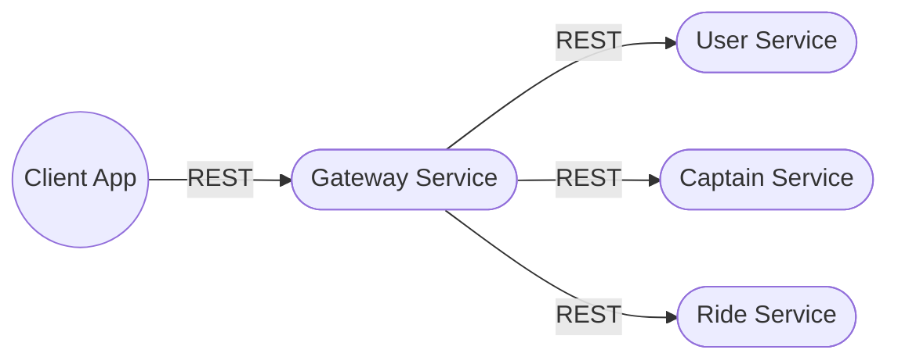

# 🚗 Micro-Services: Uber Server Model


---

## 🏗️ Modern Microservices Architecture


> **Note:** Each service (User, Captain, Ride, Gateway) is a standalone Node.js app, communicating via REST APIs and managed by a central Gateway.

---

## ✨ Features

- Modular, scalable microservices for ride-hailing platforms
- Centralized API Gateway for routing, security, and service discovery
- JWT authentication and secure cookie management
- MongoDB for persistent, scalable data storage
- Easy to extend: add payments, notifications, analytics, etc.
- Docker-ready for containerized deployment

---

## 🚦 System Overview



---

## 🚙 Animated Flow (Moving Car)

<pre>
Gateway  --->  🚗  --->  User Service
Gateway  --->  🚕  --->  Captain Service
Gateway  --->  🚙  --->  Ride Service
</pre>

---

## 🛠️ Key Concepts

- **Microservices Structure:** Each domain (User, Captain, Ride) is a separate Node.js service.
- **Gateway:** Single entry point, handles authentication, routing, and load balancing.
- **Port Sharing:** All services connect to the Gateway, which manages communication.
- **Scalability:** Each service can be scaled independently.
- **Security:** JWT-based authentication, secure cookies, and centralized validation.

---

## 📖 API Overview

| Service   | Endpoint Example           | Description                       |
|-----------|---------------------------|-----------------------------------|
| User      | `/users/register`         | Register a new user               |
| User      | `/users/login`            | User login                        |
| Captain   | `/captains/register`      | Register a new captain            |
| Captain   | `/captains/login`         | Captain login                     |
| Ride      | `/rides/create`           | Create a new ride                 |
| Ride      | `/rides/status`           | Get ride status                   |
| Gateway   | `/api/*`                  | All requests routed via gateway   |

---

## 🎬 Example Request Flow

1. User requests a ride via the client app.
2. Request goes to the **Gateway**.
3. Gateway authenticates and forwards to **Ride Service**.
4. Ride Service interacts with **User** and **Captain** services as needed.
5. All responses are routed back through the Gateway to the client.

---

## 🚗💨 Animated Car (ASCII Art)

<pre>
      ______
  ___/_____|___
 |  _     _   _|
 '-(_)--(_)--(_)-'
</pre>

---

## 📦 Tech Stack

- Node.js 18+
- Express.js 5+
- MongoDB (Mongoose)
- JWT Authentication
- RESTful APIs
- Docker (optional)

---

## � Getting Started

1. **Clone the repo:**
   ```bash
   git clone https://github.com/Santoshpatel112/Micro-Services.git
   cd Micro-Services
   ```
2. **Install dependencies:**
   ```bash
   cd user # or captain, ride, gateway
   npm install
   ```
3. **Configure environment:**
   - Copy `.env.example` to `.env` and fill in required values for each service.
4. **Start each service:**
   ```bash
   npm run dev
   ```
5. **Access the Gateway:**
   - All client requests go through the Gateway service.

---

## 🤝 Contributing

1. Fork the repository
2. Create your feature branch (`git checkout -b feature/YourFeature`)
3. Commit your changes (`git commit -am 'Add new feature'`)
4. Push to the branch (`git push origin feature/YourFeature`)
5. Open a Pull Request

---

## 📄 License

This project is licensed under the MIT License.

---

> **Enjoy exploring and building on this industry-grade Uber-style microservices architecture!**
